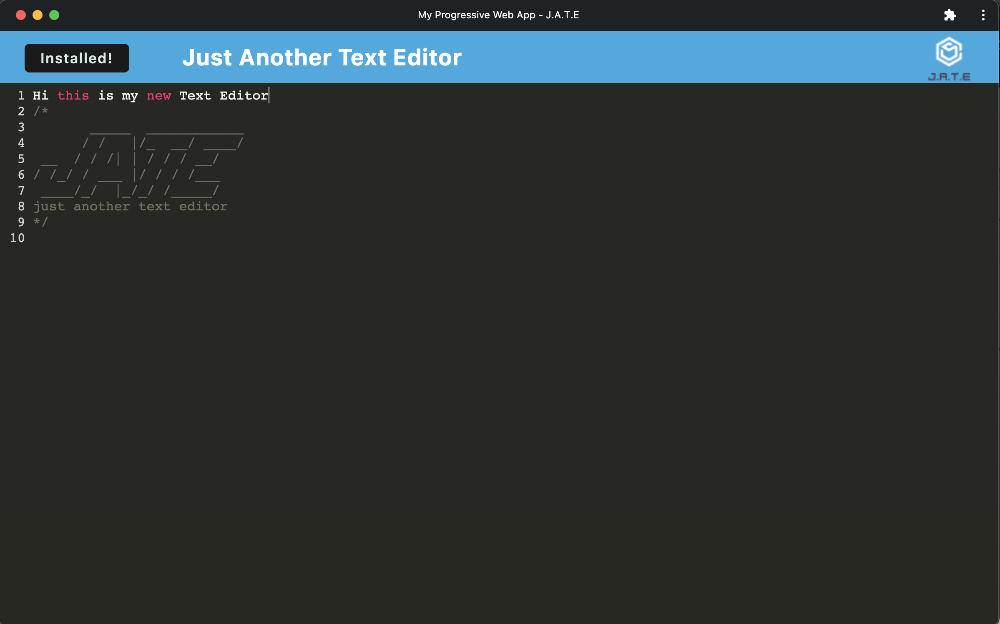

# Progressive Web Applications (PWA): Text Editor

### License

---

## Description

This application was to build a Text Editor with the Progressive Web Applications(PWA). We used a package called idb, which is a lightweight wrapper around the IndexedDB API. It features a number of data persistence techniques that serve as redundancy in case is not supported by the brower, and the application can function offline. It is useful for storing and retrieving data, and is used by companies like Google and Mozilla. 

---

## Table of Contents

1. [Installation](#installation)
2. [Usage](#usage)
3. [Test](#test)
4. [Questions](#questions)

---

## Installation Instructions

The user should clone the repository from GitHub and download Node.js. This application also requires to npm install node_modules, package-lock.json, and npm run build

---

## Usage Information

- Please open the link below and click on the "Install" button. Then you will see the message and click OK. After you installed the text editor, open it on your local machine.
 [Deploy](https://radiant-forest-41027.herokuapp.com/)

---

## Test ScreenShot

## Questions

### GitHub Profile:

https://github.com/TottoMoe

### Contact Me:

If you have any additional questions, please send me an email.

#### jennydhj@gmail.com

---
